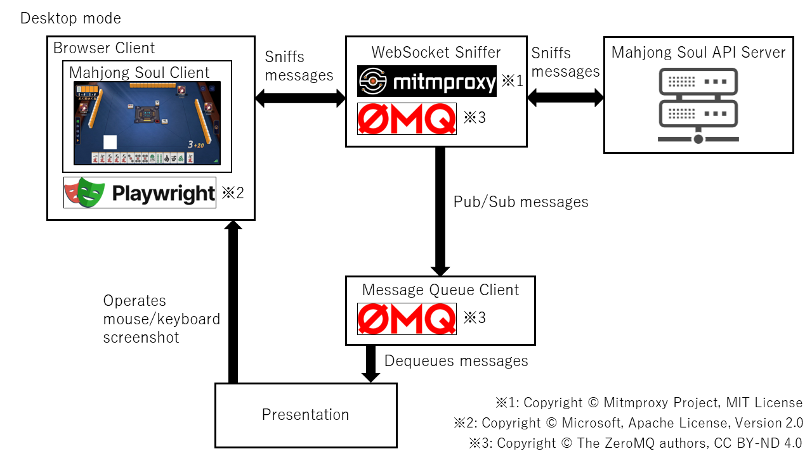
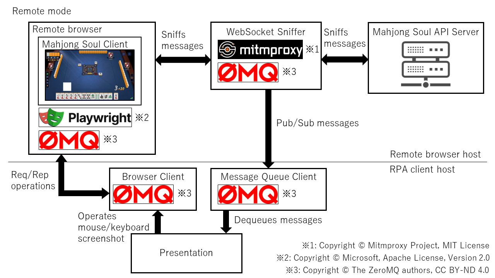

# MajsoulRPA

A Robotic Process Automation (RPA) framework for Mahjong Soul (雀魂)

This is fork of **[Cryolite's majsoul-rpa](https://github.com/Cryolite/majsoul-rpa)** with following changes.

1. Requires Python 3.11 or later
2. Removed dependencies on Docker and Redis
3. Supports moving browser position after launch
4. Mouse can be used freely even while RPA is running
5. Supports browser viewport sizes other than 1920 x 1080
6. Supports 3-player mahjong

## Announcements

- [2024/04/16] `mode` and `length` of `HomePresentation.create_room` can now be specified with non-literal variables. Please check the [source code](./src/majsoulrpa/presentation/home.py) for details.
- [2024/04/16] `user_data_dir` of `RPA.__init__` can now be specified with `pathlib.Path`.

## About The Program

- This program is intended to enable the participation of bots in friendly matches and tournaments where bot participation is explicitly allowed.
- This program does not support the functionality to enter bots into matches that are open to unspecified individuals, including, but not limited to, ranked matches and special rooms within tournament matches. Furthermore, there is no intention to introduce such functionality in the future.
- Users of this program accept full responsibility for its use. The authors shall bear no liability whatsoever for any damages resulting from utilization this program, including, but not limited to, account suspension or legal repercussions.

## Implementation concept diagram





## how to setup

```text
poetry install
poetry shell
```

## License

Copyright (c) Apricot S. All rights reserved.

Licensed under the [MIT license](LICENSE).
