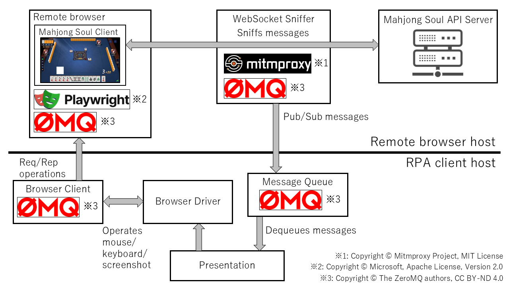

# MajsoulRPA

A Robotic Process Automation (RPA) framework for Mahjong Soul (雀魂)

This project is a fork of **[Cryolite's majsoul-rpa](https://github.com/Cryolite/majsoul-rpa)**, but has been completely redesigned based on the proactor pattern.
While some internal ideas and major class names were borrowed, the architecture and codebase are entirely new.

> [!NOTE]
> This framework is intended to enable the participation of bots in friendly matches and tournaments where bot participation is agreed upon by all players involved.
>
> This framework does not support the functionality to enter bots into open matches (including, but not limited to, ranked matches and special rooms within tournament matches). Furthermore, there is no intention to introduce such functionality in the future.

> [!WARNING]
> Users of this framework accept full responsibility for its use. The authors shall bear no liability whatsoever for any damages resulting from utilization of this framework, including, but not limited to, account suspension or legal repercussions.

## Key differences from the original project

- ✅ Requires **Python 3.12** or later
- 🗑️ Removed dependencies on **Docker** and **Redis**
- 🖥️ Supports moving browser window position after launch
- 🖱️ Mouse can be used freely even while RPA is running
- 📐 Supports browser viewport sizes other than **1920 × 1080**
- 🀄 Supports **three-player mahjong**

## Implementation concept diagram



## Installation

```sh
majsoulrpa$ pip install .
majsoulrpa$ playwright install --with-deps chromium
```

## Usage

See [examples/](examples/) for usage examples.

> [!IMPORTANT]
> The email address you use must be linked to your Yostar ID.
> See [discussion #287](https://github.com/Apricot-S/majsoulrpa/discussions/287) for more details.

## License

Licensed under the [MIT license](LICENSE).
